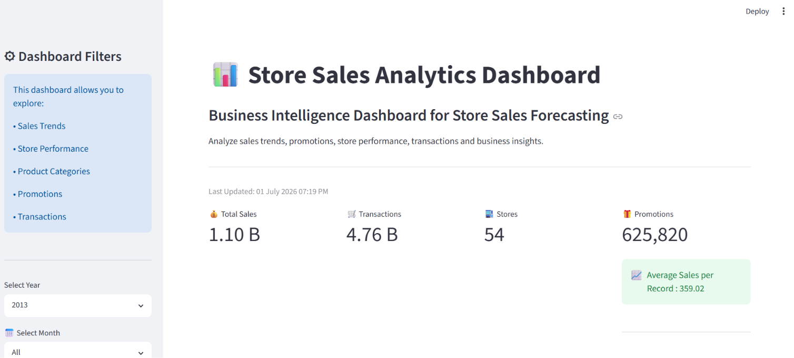
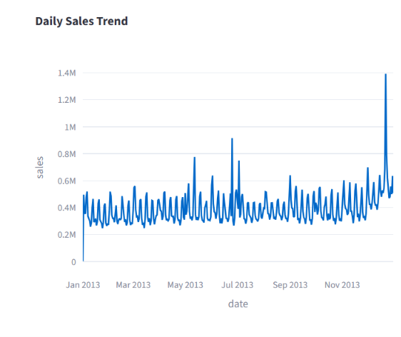
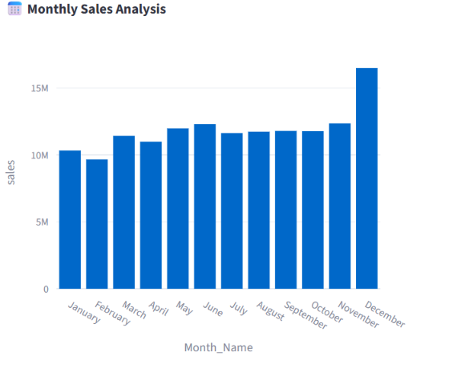
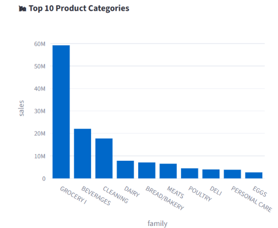
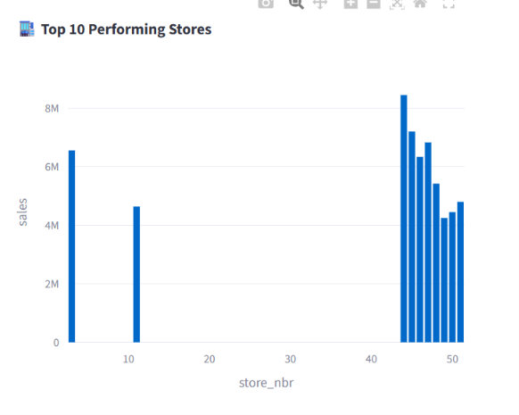
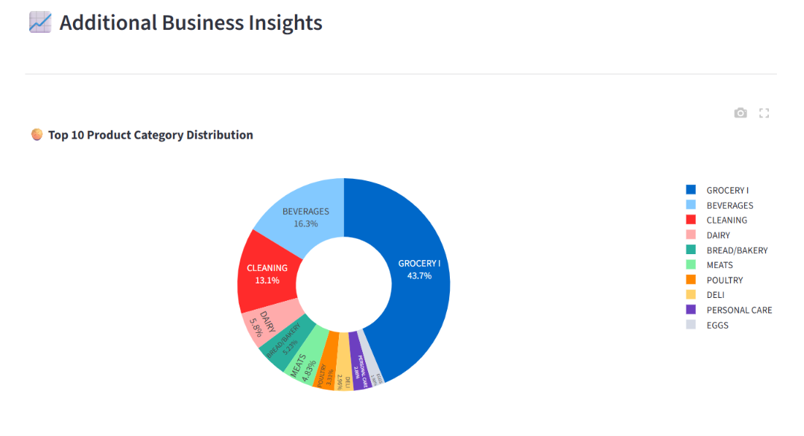
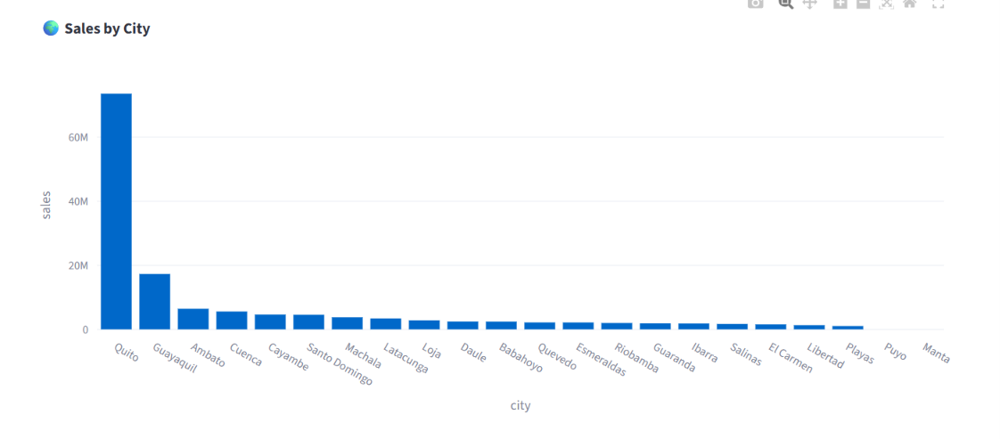
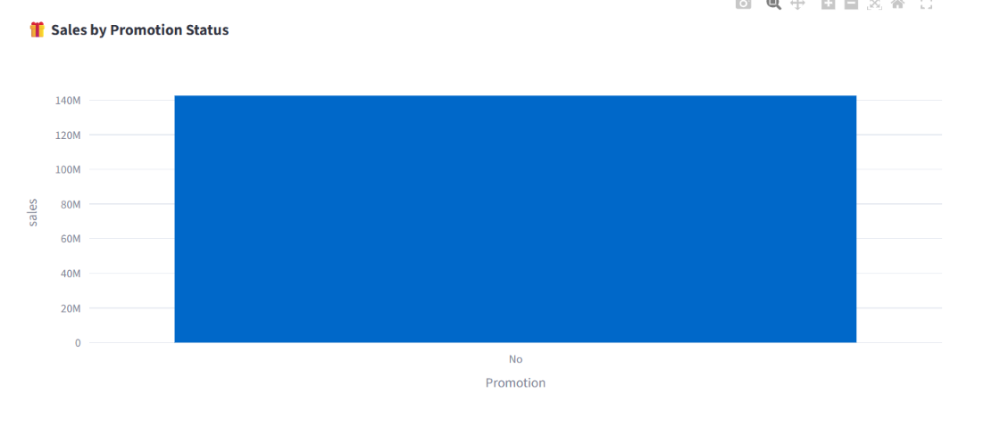
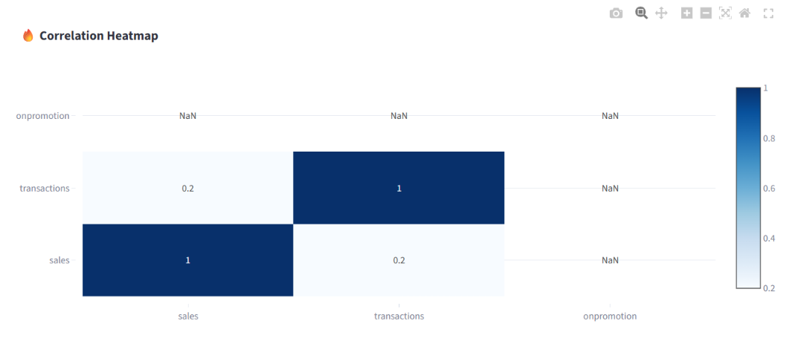

# 📊 Store Sales Analytics Dashboard

> An interactive Business Intelligence Dashboard built using **Python, Pandas, Plotly, and Streamlit** for analyzing store sales data.

---

## 📌 Project Overview

This project analyzes historical store sales data from the Kaggle **Store Sales Forecasting** dataset. The dashboard helps users explore sales trends, product performance, store performance, promotions, transactions, and business insights through interactive visualizations.

This project was developed as part of an internship to demonstrate skills in:

- Data Cleaning
- Exploratory Data Analysis (EDA)
- Data Visualization
- Business Intelligence Dashboard Development
- Feature Engineering
- Interactive Dashboard Design

---

## 🚀 Features

✅ Data Cleaning

✅ Data Preprocessing

✅ Feature Engineering

✅ Interactive Dashboard

✅ KPI Cards

✅ Year, Month, Store, City and Product Filters

✅ Sales Trend Analysis

✅ Monthly Sales Analysis

✅ Product Category Analysis

✅ Store Performance Analysis

✅ Promotion Analysis

✅ Correlation Heatmap

✅ Download Filtered Dataset

---

## 📂 Dataset

Dataset Source:

Store Sales Forecasting Dataset (Kaggle)

https://www.kaggle.com/competitions/store-sales-time-series-forecasting/data

Files Used:

- train.csv
- stores.csv
- oil.csv
- transactions.csv
- holidays_events.csv

---

## 🛠 Technologies Used

- Python
- Pandas
- NumPy
- Plotly
- Streamlit
- Matplotlib
- Git
- GitHub
- VS Code

---

## 📁 Project Structure

Sales_Data_Analysis_Dashboard/

│

├── dashboard/

│ └── app.py

│

├── notebooks/

│ └── sales_analysis.ipynb

│

├── processed_data/

│ └── master_sales_data.csv

│

├── reports/

│ └── Business_Insights_Report.pdf

│

├── images/

│ ├── dashboard.png

│

├── README.md

├── requirements.txt

└── .gitignore

---

## 📈 Dashboard Features

The dashboard includes:

- KPI Cards
- Daily Sales Trend
- Monthly Sales Analysis
- Product Category Distribution
- Top Performing Stores
- Sales by City
- Promotion Analysis
- Correlation Heatmap
- Interactive Filters
- Download CSV

---

## 💼 Business Insights

Some key business insights generated from the analysis include:

- Grocery products contribute the highest sales.
- Promotions significantly influence sales performance.
- Sales vary across different cities and stores.
- Daily sales show seasonal patterns.
- Store performance differs based on location.
- Transactions have a positive relationship with sales.

---

## ▶️ How to Run the Project

Clone the repository

```bash
git clone https://github.com/sohel-917/Sales_Data_Analysis_Dashboard.git
```

Move into the project folder

```bash
cd Sales_Data_Analysis_Dashboard
```

Create a virtual environment

```bash
python -m venv venv
```

Activate the environment

Windows

```bash
venv\Scripts\activate
```

Install dependencies

```bash
pip install -r requirements.txt
```

Run the Streamlit dashboard

```bash
streamlit run dashboard/app.py
```

---

## 📷 Dashboard Preview

### 🏠 Dashboard Home



---

### 📈 Daily Sales Trend



---

### 📅 Monthly Sales Analysis



---

### 🛍 Top Product Categories



---

### 🏬 Top Performing Stores



---

### 🥧 Product Category Distribution



---

### 🌍 Sales by City



---

### 🎁 Promotion Analysis



---

### 🔥 Correlation Heatmap



---

## 📌 Future Improvements

- Sales Forecasting using Machine Learning
- Customer Segmentation
- Profit Analysis
- Regional Sales Mapping
- Forecast Dashboard
- Real-time Data Integration

---

## 👨‍💻 Developed By

**Sk Sohel**

GitHub:

https://github.com/sohel-917

---

## ⭐ If you found this project useful, consider giving it a Star!